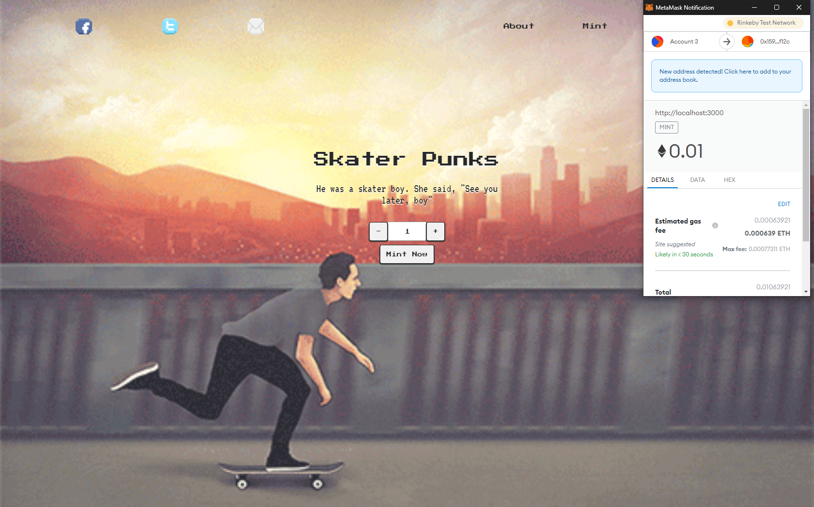

# Skater Punks Front End



## Overview

This repository contains the source code for the Skater Punks minting dApp website.
Check out the demo [here](https://skater-punks.herokuapp.com/).

## Requirements

- [node.js](https://nodejs.org/en/download/)

## Installation

First ensure that [node.js](https://nodejs.org/en/download/) is installed then run:

```bash
npm install
```
